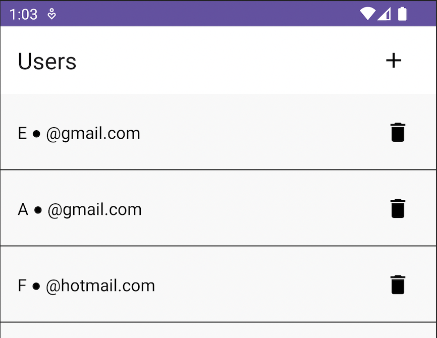
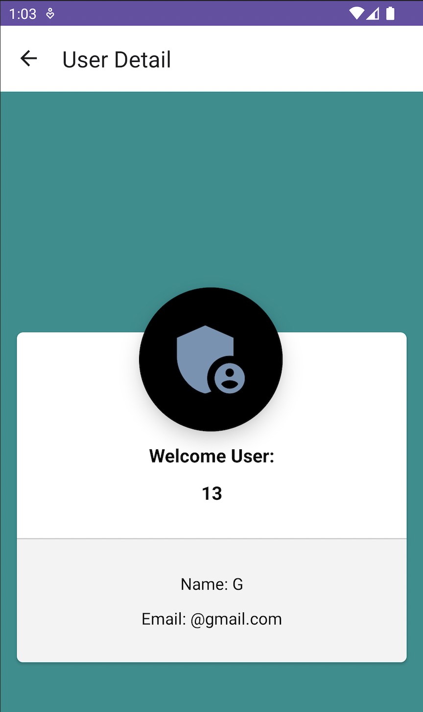

<h1 align="center">EncryptedRoomDB</h1> 

<p align="center">
This app was created to learn the use of Room database encrypted with SQLCipher.
</p>

## Installation

Clone this repository and import into **Android Studio**

```bash
git clone https://github.com/munbonecci/EncryptedRoomDB.git
```

## Build variants

Use the Android Studio *Build Variants* button to choose between **debug** and **release**
flavors

## Maintainers

This project is maintained by:

* [Edmundo Bonequi](http://github.com/munbonecci)

## Architecture

This App has the Clean Architecture approach where we can handle different layers,
including use cases and view model to obtain the data

## Built with

- [Kotlin](https://kotlinlang.org/) - For coding.
- [Room DB](https://developer.android.com/training/data-storage/room) - For Room database
- [SQLCipher](https://github.com/sqlcipher/android-database-sqlcipher) - For DB encryption
- [KSP](https://developer.android.com/build/migrate-to-ksp) Kotlin Symbol Processing
- Jetpack
    - [Navigation Component](https://developer.android.com/guide/navigation/navigation-getting-started)
        - Handling and manage the navigation in the app.

## How I run the app?

- Clone the repository
- Open it in Android Studio
- Wait until dependencies are installed
- Run app in your emulator or physical device



